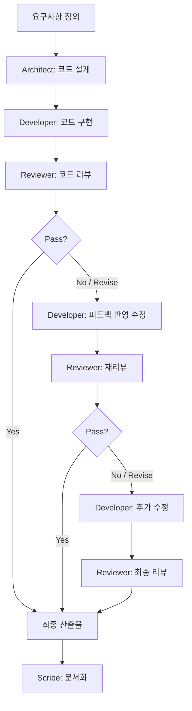

# Code Generation Pattern

> 코드 설계 → 구현 → 리뷰를 체계적으로 수행하는 에이전트 협업 패턴

## 패턴 소개

Architect가 요구사항을 분석하여 코드 설계를 수립하고, Developer가 설계에 따라 코드를 구현하며, Reviewer가 품질·보안·설계 준수 여부를 검증하는 소프트웨어 개발 특화 패턴입니다.

## 에이전트 구성

| 역할 | 설명 |
|------|------|
| **Architect** | 요구사항을 분석하여 코드 구조, 인터페이스, 의존성, 디자인 패턴을 설계 |
| **Developer** | Architect의 설계에 따라 실제 코드를 구현 |
| **Reviewer** | 코드 리뷰 — 보안, 코드 품질, 설계 준수, 테스트 커버리지를 검증하고 Pass/Revise 판정 |
| **Scribe** | 설계·구현·리뷰 과정 전체를 기록·요약 |

## 실행 방법

```bash
copilot --agent code_generation --yolo
```

또는 Squad에 직접 요청:

```
Squad, 사용자 프로필 API를 설계하고 구현하고 리뷰해줘
```

## 진행 흐름

1. **Architect** → 코드 설계 (구조, 인터페이스, 파일 구성, 의존성)
2. **Developer** → 설계에 따라 코드 구현
3. **Reviewer** → 코드 리뷰 (Pass/Revise 판정)
4. Revise → **Developer**가 피드백 반영하여 수정 → 재리뷰 (최대 3 Cycles)
5. Pass → **Scribe** 문서화

## 패턴 다이어그램


