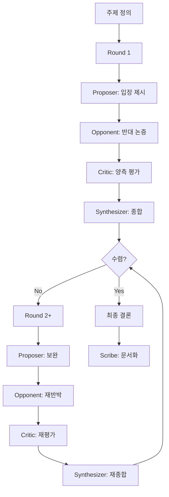

# Debate & Critic Pattern

> 대립적 논증과 비평을 통해 최선의 결론에 도달하는 에이전트 협업 패턴

## 패턴 소개

두 명의 Debater(Proposer/Opponent)가 서로 다른 입장에서 논증하고, Critic이 중립적으로 평가하며, Synthesizer가 최종 결론을 도출하는 변증법적 의사결정 패턴입니다.

## 에이전트 구성

| 역할 | 설명 |
|------|------|
| **Proposer** | 특정 입장을 제안하고 근거를 들어 옹호 |
| **Opponent** | 반대 입장에서 논증하고 약점을 지적 |
| **Critic** | 양측 논증을 중립적으로 평가·분석 |
| **Synthesizer** | 논의를 종합하여 최종 결론·권고 도출 |
| **Scribe** | 전체 논의 과정을 기록·요약 |

## 실행 방법

```bash
copilot --agent debate_critic --yolo
```

또는 Squad에 직접 요청:

```
Squad, REST API vs GraphQL 중 우리 프로젝트에 어떤 걸 쓸지 토론해줘
```

## 진행 흐름

1. **Proposer** → 입장 제시
2. **Opponent** → 반대 논증
3. **Critic** → 양측 평가
4. **Synthesizer** → 종합 및 수렴 판단
5. 수렴하지 않으면 → 다음 Round (최대 3회)
6. 수렴 시 → **Scribe** 문서화

## 패턴 다이어그램


