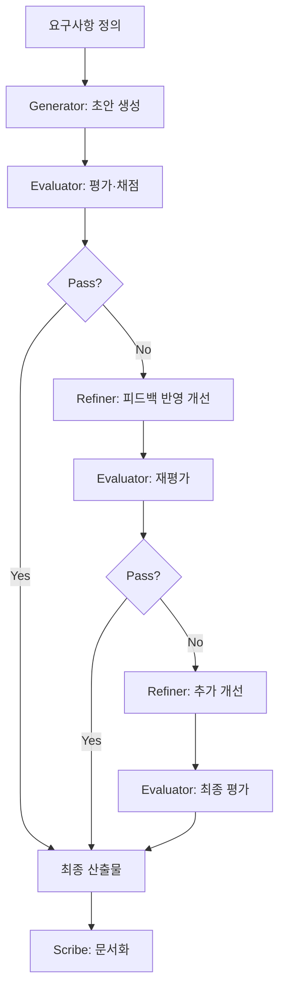

# Generator & Evaluator Pattern

> 생성과 평가를 분리하여 반복 개선으로 품질을 높이는 에이전트 협업 패턴

## 패턴 소개

Generator가 콘텐츠·코드·솔루션을 생성하고, Evaluator가 기준에 따라 평가·채점하며, Refiner가 피드백을 반영해 개선하는 순환 패턴입니다.

## 에이전트 구성

| 역할 | 설명 |
|------|------|
| **Generator** | 요구사항을 분석하여 초안(코드·문서·설계)을 생성 |
| **Evaluator** | 기준표에 따라 산출물을 평가·채점하고 개선점 제시 |
| **Refiner** | Evaluator 피드백을 반영하여 산출물을 구체적으로 개선 |
| **Scribe** | 각 Cycle의 변경 이력과 최종 결과를 기록·요약 |

## 실행 방법

```bash
copilot --agent generator_evaluator --yolo
```

또는 Squad에 직접 요청:

```
Squad, 사용자 인증 API 코드를 생성하고 리뷰해줘
```

## 진행 흐름

1. **Generator** → 초안 생성
2. **Evaluator** → 평가·채점 (Pass/Fail)
3. Fail → **Refiner** 개선 → 재평가 (최대 3 Cycles)
4. Pass → **Scribe** 문서화

## 패턴 다이어그램


