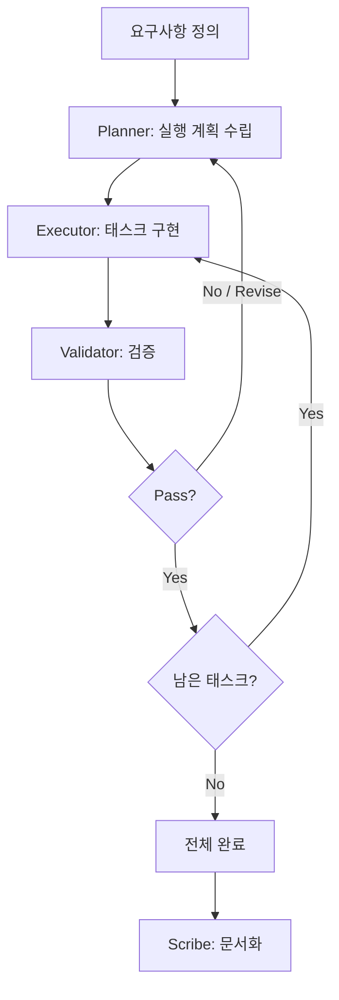

# Planner & Executor Pattern

> 계획 수립과 실행을 분리하여 체계적으로 작업을 완수하는 에이전트 협업 패턴

## 패턴 소개

Planner가 요구사항을 분석하여 구조화된 실행 계획을 수립하고, Executor가 태스크별로 구현하며, Validator가 각 태스크의 완료 기준 충족 여부를 검증하는 패턴입니다.

## 에이전트 구성

| 역할 | 설명 |
|------|------|
| **Planner** | 요구사항을 분석하고 태스크·의존성·순서를 포함한 실행 계획 수립 |
| **Executor** | 계획에 따라 태스크를 하나씩 구현·실행 |
| **Validator** | 각 태스크의 완료 기준 충족 여부를 검증 |
| **Scribe** | 계획·실행·검증 과정 전체를 기록·요약 |

## 실행 방법

```bash
copilot --agent planner_executor --yolo
```

또는 Squad에 직접 요청:

```
Squad, 결제 시스템 통합을 계획하고 실행해줘
```

## 진행 흐름

1. **Planner** → 태스크 목록·의존성·완료 기준 수립
2. **Executor** → 태스크 순서대로 구현
3. **Validator** → Pass/Revise 판정
4. Revise → **Planner** 계획 수정 후 재실행
5. 모든 Pass → **Scribe** 문서화

## 패턴 다이어그램


